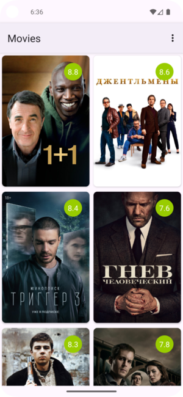
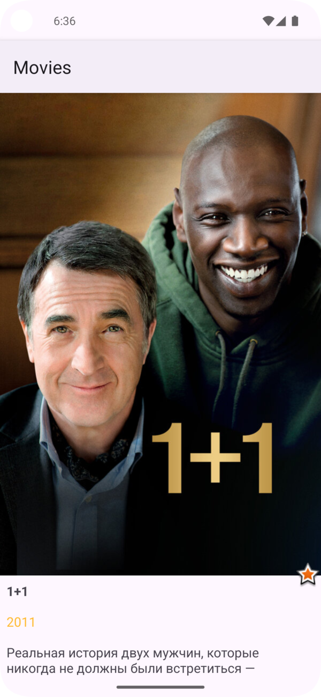
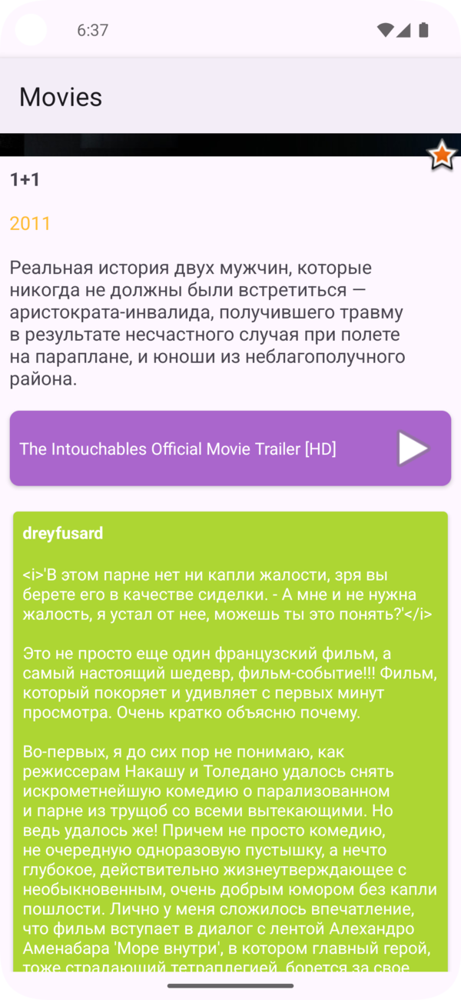

# Android Movies App

Простое Android‑приложение для просмотра информации о фильмах. Проект демонстрирует базовые принципы работы с сетевыми запросами, загрузкой изображений и отображением данных в списке на платформе Android.

> Учебный и демонстрационный проект, написанный на Java.

---

## Содержание

- [О проекте](#о-проекте)
- [Возможности](#возможности)
- [Скриншоты](#скриншоты)
- [Технологии](#технологии)
- [Структура проекта](#структура-проекта)
- [Установка и запуск](#установка-и-запуск)
- [Автор проекта](#автор-проекта)

---

## О проекте

**Android Movies App** — это учебное Android‑приложение, которое получает данные о фильмах из открытого API (например, TMDB) и отображает их пользователю в удобном формате.

Проект создан с упором на:
- изучение основ сетевого взаимодействия в Android
- работу с JSON и парсинг данных
- загрузку и кэширование изображений
- построение адаптивных списков

---

## Возможности

- Просмотр списка популярных или актуальных фильмов
- Детальная информация о каждом фильме (название, описание, рейтинг, дата выхода)
- Загрузка и отображение постеров фильмов из интернета
- Поиск фильмов по названию (при наличии)

---

## Скриншоты

### Главный экран (список фильмов)


### Экран с постером


### Экран с деталями



---

## Технологии

- Язык программирования: Java
- Платформа: Android
- Сетевые запросы: Retrofit
- Загрузка изображений: Glide / Picasso
- Парсинг JSON: Gson / Moshi
- Система сборки: Gradle
- UI: XML layouts

---

## Структура проекта

```text
android-app-movies/
├── app/
│   ├── src/main/
│   │   ├── java/                # Исходный код приложения
│   │   │   └── com/valmork/movies/
│   │   │       ├── model/        # Классы данных (POJO)
│   │   │       ├── network/      # Классы для работы с API
│   │   │       ├── ui/           # Activity и адаптеры
│   │   │       └── utils/        # Вспомогательные классы
│   │   ├── res/                  # Ресурсы (layout, drawable, values)
│   │   └── AndroidManifest.xml
│   └── build.gradle
├── gradle/
├── screenshots/                  # Скриншоты приложения
└── README.md
```

---

## Установка и запуск

```bash
git clone https://github.com/valmork/android-app-movies.git
```

1. Откройте проект в Android Studio
2. Дождитесь завершения синхронизации Gradle
3. Запустите приложение на эмуляторе или физическом устройстве

---

## Автор проекта

**valmork - Королев Антон**
